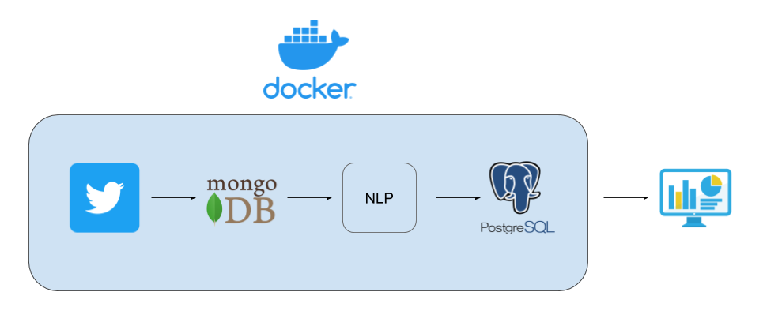

# tweet-collector
Full pipeline to collect tweets, do a sentiment analysis and store the results in a SQL database

##### This Docker Pipeline combines multiple tasks:

1. Collect tweets filtered by user defined keywords using the twitter API
2. Store tweets in a mongoDB database
3. Do a sentiment analysis using https://github.com/cjhutto/vaderSentiment
4. Store the clean results in a PostgreSQL database

#### Requirements:

- [Docker](https://store.docker.com/search?type=edition&offering=community)
- [Docker Compose](https://docs.docker.com/compose/install/)
